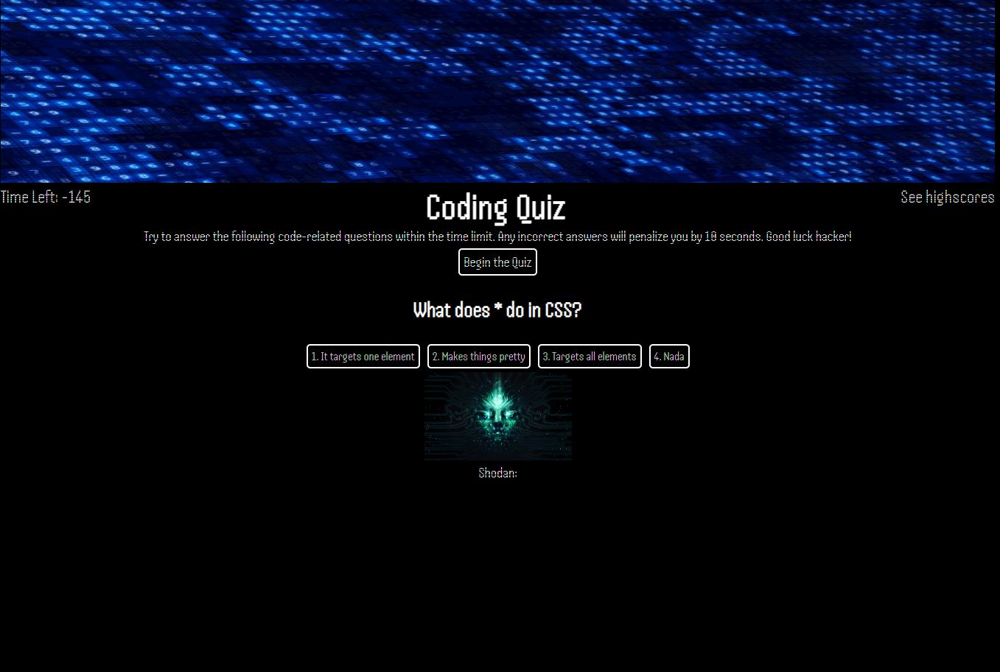

# Code-Quiz

Live deployed link: https://daniel-0117.github.io/Shodans-Code-Quiz/

## Description
This project was created so new coders have a place to test new skils they learned. Themed after the game series system shock it creates a fun atmosphere were the user is tested by Shodan herself. 

## Usage
Once the user is at the quiz homepage all the user has to do is press the begin quiz page. The timer will begin and a question will appear with four multiple choice answers. With each incorrect answer the user loses 10 seconds. Eiher way the question progresses. 

  ## Table of Contents

- [Description](#description)

- [Usage](#usage)

- [Technologies used](#technologies-used)

- [Credits](#credits)

- [License](#license)

# HOME PAGE!

# OTHER PAGE!

## Technologies used!
- HTML
- CSS
- Javascript

## Credits
Daniel Pacheco: https://github.com/Daniel-0117

## License

### User Story!

GIVEN I am taking a code quiz
WHEN I click the start button
THEN a timer starts and I am presented with a question
WHEN I answer a question
THEN I am presented with another question
WHEN I answer a question incorrectly
THEN time is subtracted from the clock
WHEN all questions are answered or the timer reaches 0
THEN the game is over
WHEN the game is over
THEN I can save my initials and my score